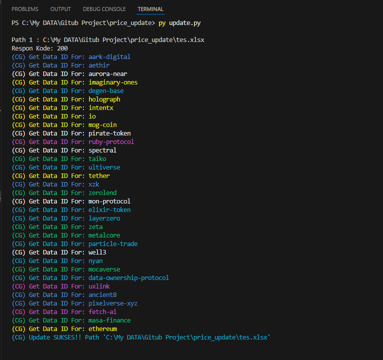
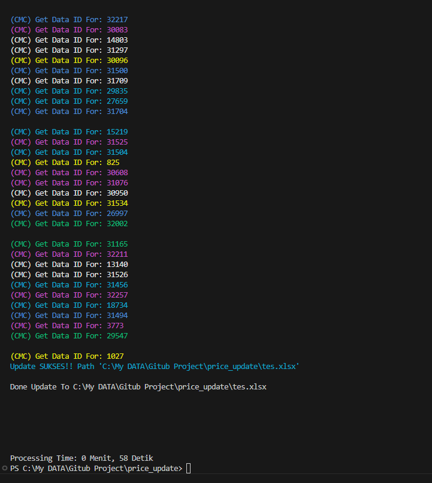
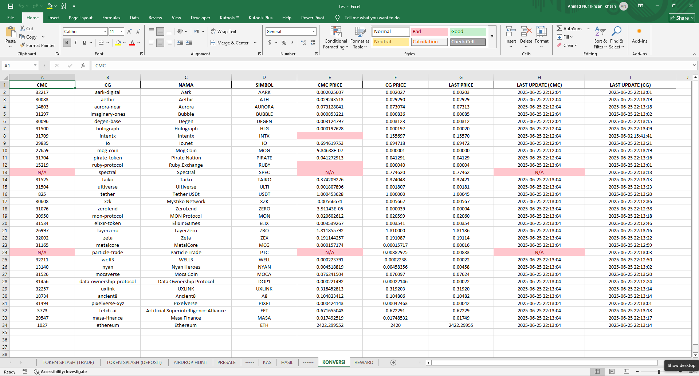

<h1 align="center">🚀 Crypto Excel Price & Reward Updater 📈</h1>
<p align="center">
  <b>Otomatisasi update harga & reward kripto ke file Excel menggunakan API CoinGecko dan CoinMarketCap</b>
</p>

---

## 🚀 Deskripsi Singkat

**Crypto Excel Price & Reward Updater** adalah kumpulan skrip Python yang secara otomatis:
- Mengambil harga terbaru cryptocurrency dari dua sumber berbeda (CoinGecko & CoinMarketCap) dan memperbaruinya ke file Excel Anda.
- Menyinkronkan dan memperbarui data reward di Excel berdasarkan harga terbaru.
- Dengan dua sumber harga, Anda bisa membandingkan harga dan mendapatkan hasil yang lebih akurat, serta memastikan reward selalu terupdate.

---

## 🏆 Studi Kasus: Monitoring Reward & Airdrop Crypto (Bybit Splash & Lainnya)

Proyek ini dibuat sebagai **alat bantu monitoring usaha pada BYBIT SPLASH dan airdrop crypto lainnya**.  
Pada program airdrop seperti ini, reward biasanya diberikan dalam bentuk koin kripto dengan harga yang selalu berubah-ubah.  
Syarat mendapatkan reward biasanya berdasarkan volume transaksi tertentu, dan reward yang didapat bisa berbeda-beda setiap waktu.

Dengan alat ini, Anda cukup **sekali input jenis koin dan jumlah koin yang didapat** pada file Excel, maka:
- Estimasi nilai reward (dalam USD atau mata uang lain) akan otomatis terupdate secara real-time.
- Data harga diambil dari dua sumber (CoinGecko & CoinMarketCap) untuk akurasi dan backup.
- Semua data reward, volume, dan estimasi value akan otomatis tersinkronisasi dan tercatat di Excel, baik di file lokal maupun cloud (OneDrive) sebagai backup otomatis.

### Manfaat untuk Pengguna BYBIT SPLASH & Airdrop Crypto:
- **Tidak perlu cek harga manual:** Harga dan estimasi reward selalu update otomatis.
- **Backup otomatis:** Data Anda aman di dua lokasi (lokal & cloud) jika diaktifkan.
- **Mudah monitoring:** Semua histori reward, volume, dan estimasi value tercatat rapi di Excel.
- **Bisa digunakan untuk berbagai event airdrop dan reward exchange lain.**

> **Catatan:**  
> Anda bisa menyesuaikan path file Excel, sheet, dan kolom sesuai kebutuhan.  
> Tool ini sangat cocok untuk trader, hunter airdrop, dan siapapun yang ingin memantau reward kripto.

---

## 🛠️ Fitur

- 🔄 Update harga kripto otomatis dari CoinGecko dan CoinMarketCap API.
- 📝 Menulis harga dan waktu update ke kolom khusus di sheet Excel.
- 🌏 Konversi waktu update ke zona waktu WIB (Asia/Jakarta).
- 📊 Mendukung multi-koin sekaligus.
- 🎨 Tampilan terminal berwarna (khusus CoinMarketCap).
- ⏳ Otomatis jeda jika request API sudah mencapai limit.
- 🔗 Sinkronisasi otomatis data reward dengan harga terbaru di Excel.
- 📁 **Mendukung multi-file Excel untuk backup** (bisa custom, contoh di README hanya 1 file, bisa diperbanyak sesuai kebutuhan).

---

## 📦 Instalasi

1. **Clone repository ini:**
    ```
    git clone https://github.com/username/price_update.git
    ```
2. **Install dependencies:**
    ```
    pip install -r [requirements.txt](http://_vscodecontentref_/2)
    ```
    **Dependencies:**
    - requests
    - pandas
    - openpyxl
    - pytz
    - colorama

---

## 📂 Struktur Folder Project

```
price_update/
├── asset/                   # Gambar/logo untuk dokumentasi
│   ├── coingecko.png
│   ├── coinmarketcap.png
│   └── hasil.png
├── doc/                     # File Excel utama (data, backup, dsb)
│   ├── coba.xlsx
│   └── tes.xlsx
├── apikey.json              # File API key (jangan di-push ke repo publik)
├── fungsi_coingecko.py      # Script update harga dari CoinGecko
├── fungsi_coinmarketcap.py  # Script update harga dari CoinMarketCap
├── fungsi_reward.py         # Script sinkronisasi & update reward
├── update.py                # Script utama untuk menjalankan update otomatis
├── requirements.txt         # Daftar dependencies Python
├── README.md                # Dokumentasi project
└── .gitignore               # File/folder yang diabaikan git

---

## ⚙️ Cara Penggunaan

### 1. Update Harga Kripto

- **CoinGecko:**
    ```python
    from fungsi_coingecko import run
    run(r"PATH/TO/YOUR/EXCEL.xlsx")
    ```

- **CoinMarketCap:**
    ```python
    from fungsi_coinmarketcap import main
    main(r"PATH/TO/YOUR/EXCEL.xlsx")
    ```

### 2. Sinkronisasi & Update Reward Otomatis

- **Reward Updater:**
    ```python
    from fungsi_reward import main
    main()
    ```
    - Pastikan path Excel sudah sesuai di script.
    - Data reward akan diupdate dan disinkronkan ke sheet `REWARD` di file Excel Anda.

---

## ⚡ Penjelasan Singkat Kode

- **fungsi_coingecko.py:**  
  Mengambil harga dan waktu update dari CoinGecko, menulis ke kolom "CG PRICE" (F) dan "LAST UPDATE (CG)" (I).
- **fungsi_coinmarketcap.py:**  
  Mengambil harga dan waktu update dari CoinMarketCap, menulis ke kolom "CMC PRICE" (E) dan "LAST UPDATE (CMC)" (H), serta menampilkan proses di terminal dengan warna.
- **fungsi_reward.py:**  
  Menyinkronkan dan memperbarui data reward di sheet `REWARD` pada file Excel Anda berdasarkan harga terbaru.

---

### ▶️ Menjalankan Script Otomatis Lewat Batch (Windows)

Anda bisa menjalankan update otomatis dengan mudah menggunakan file batch berikut:

```bat
@echo off
python "update.py"
Pause

---

### Cara Pakai

1. **Simpan kode batch di atas sebagai `update.bat`** (misal di folder `doc/`).
2. **Double klik file `update.bat`** untuk menjalankan update harga dan reward secara otomatis.
3. Jendela akan tetap terbuka setelah selesai, sehingga Anda bisa melihat hasil atau pesan error.

**Tips:**  
Pastikan Python sudah terinstall dan environment variable sudah diatur agar perintah `python` bisa dijalankan dari command prompt.

---

## ⚠️ Catatan

- Pastikan file Excel tidak sedang dibuka saat menjalankan skrip.
- API CoinGecko dan CoinMarketCap memiliki rate limit, gunakan dengan bijak.
- Ganti API key pada masing-masing skrip dengan milik Anda jika diperlukan.
- Untuk kebutuhan backup, Anda bisa menambahkan/mengatur lebih dari satu file Excel pada script (cukup duplikasi pemanggilan fungsi dengan path berbeda).

---

### 🔒 Sistem Backup Otomatis

Anda dapat mengatur script untuk update ke **lebih dari satu file Excel** (misal: lokal & cloud/OneDrive) untuk backup otomatis.  
Pada contoh di README hanya digunakan 1 file, namun Anda bisa menambah file Excel lain sesuai kebutuhan dengan menambah pemanggilan fungsi pada path yang berbeda.

---

## 📸 Screenshot Aplikasi

| Deskripsi                 | Cuplikan                                      |
| ------------------------- | --------------------------------------------- |
| Coingecko Process         |        |
| Coinmarketcap Process     |      |
| Hasil                     |                      |

---

## 📄 Lisensi

MIT License

---

<p align="center">
  
  
  Dibuat dengan ❤️ oleh AHMAD NUR IKHSAN
</p>